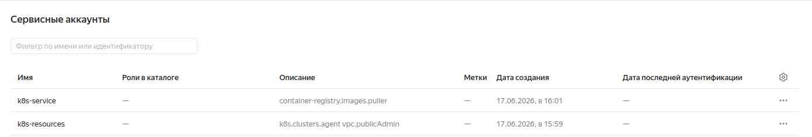
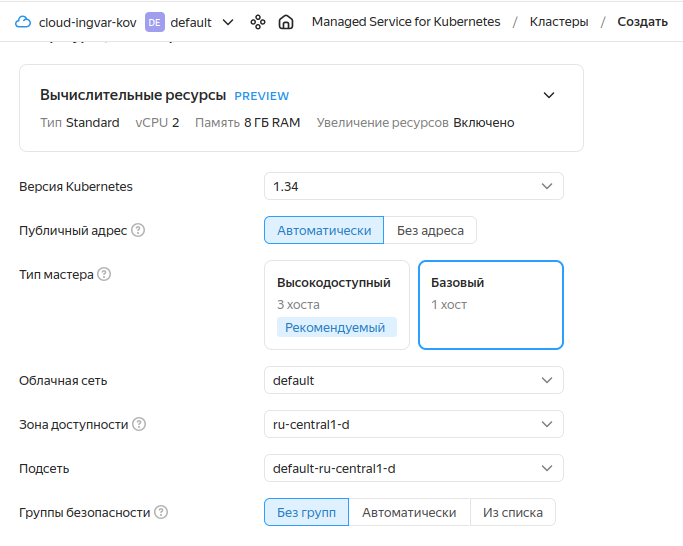
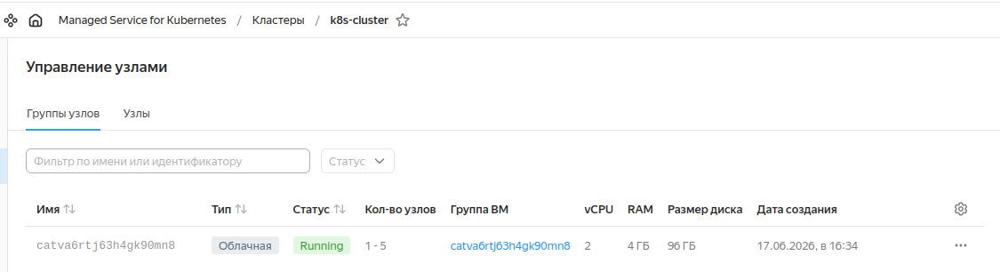
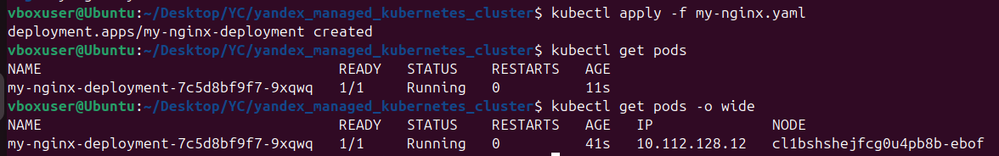
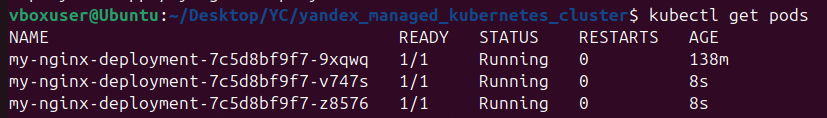
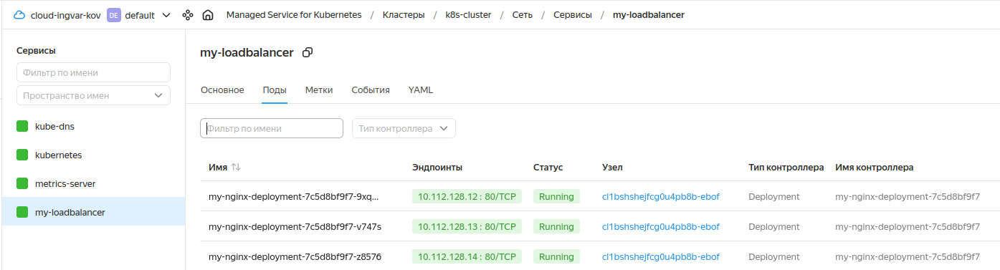

# Создание и настройка кластера Kubernetes в облачной инфраструктуре Yandex Cloud.

## 1. Создание кластера.

1.1. Для Kubernetes необходимы сервисные аккаунты для создания ресурсов и для работы с реестром Docker-образов.

Создаем два разных аккаунта:
  * Сервисный аккаунт для создания ресурсов — это аккаунт, под которым сервису Kubernetes будут выделяться ресурсы в облаке. Назначьте этому аккаунту роли k8s.clusters.agent и vpc.publicAdmin для использования публичных адресов.
  * Сервисный аккаунт — это аккаунт, от имени которого узлы будут скачивать из реестра необходимые Docker-образы. Назначьте этому аккаунту роль container-registry.images.puller.

1.2. Настраиваем конфигурацию мастера и создаем кластер.

  * Выберите версию Kubernetes. Набор предложенных версий зависит от релизного канала. Версии мастера и других нод могут не совпадать, но это достаточно тонкая настройка, могут возникнуть проблемы совместимости, которые повлияют на работу всего кластера.
  * Кластеру может назначаться публичный IP-адрес. Выберите вариант Автоматически. В этом случае IP выбирается из пула свободных IP-адресов. Если вы не используете Cloud Interconnect или VPN для подключения к облаку, то без автоматического назначения IP-адресов вы не сможете подключиться к кластеру: он будет доступен только во внутренней сети вашего облака.
  * Тип мастера влияет на отказоустойчивость. Базовый работает только в одной зоне доступности, а высокодоступный может работать в одной зоне доступности и одной подсети или в трёх разных зонах доступности.
  * Выбор типа мастера также влияет на подсети, в которых будет развёрнут кластер. У вас уже есть подсети, созданные по умолчанию для функционирования облака. Выберите их.
  * Конфигурация вычислительных ресурсов для мастера настраивается в зависимости от предполагаемого размера кластера. Для тестовых кластеров оставьте минимальное количество ресурсов из раздела Standart.

1.3. Создание группы узлов.
Заходим в созданный кластер, на вкладке Управление узлами и нажимаем Создать группу узлов указывая необходимые параметры.

## 2. Запуск приложения в кластере.

2.1. Установка kubectl и подключение к кластеру.

  * Для подключения к кластеру установите CLI и добавьте учетные данные кластера Kubernetes в конфигурационный файл kubectl `yc managed-kubernetes cluster get-credentials --id cluster_id --external`.
  * Чтобы проверить правильность установки и подключения, посмотрите на конфигурацию при помощи команды`kubectl config view`.

2.2. Создание kubernetes манифеста.
Для описания настроек приложения в кластере создан манифест [my-nginx.yaml](my-nginx.yaml), состоящий из блоков:
  * Директива apiVersion определяет, для какой версии Kubernetes написан манифест. От версии к версии обозначение может меняться.
  * Директива kind  описывает механизм использования. Она может принимать значения Deployment, Namespace, Service, Pod, LoadBalancer. Для развёртывания приложения укажите значение Deployment.
  * Директива metadata определяет метаданные приложения: имя, метки (labels), аннотации. С помощью Меток можно идентифицировать, группировать объекты, выбирать их подмножества. Добавляйте и изменяйте метки при создании объектов или позднее, в любое время.
  * В основном блоке spec содержится описание объектов Kubernetes. Директива replicas определяет масштабирование. Директива selector определяет, какими подами будет управлять контейнер. Поды отбираются с помощью метки (label). Директива template определяет шаблон пода. Метка в шаблоне должна совпадать с меткой селектора — nginx.
  * Директива spec задаёт настройки контейнеров, которые будут развёрнуты на поде.

2.3. Применение манифеста.
  * Для создания или обновления ресурсов в кластере используется команда apply. Файл манифеста указывается после флага -f.
`kubectl apply -f <путь_к_файлу_my-nginx.yaml>`
  * При помощи команды `kubectl get pods` проверяем успешность запуска приложения.

2.4. Масштабирование.
Увеличить количество подов вручную можно двумя способами:
  * Изменить файл манифеста, указав в директиве `replicas` нужное число подов, и снова выполнить команду `apply`.
  * Использовать команду scale `kubectl scale --replicas=3 deployment/my-nginx-deployment`.

  * После применения команды видно увеличение числа реплик приложения до заданного значения.

## 3. Балансировка нагрузки.

У созданного пода есть внутренний IP-адрес. Однако внутренний IP-адрес может меняться, когда ресурсы группы узлов обновляются. Чтобы обращаться к приложению извне, требуется неизменный публичный IP-адрес. Для этой цели создается балансировщик.

3.1. Создан манифест [load-balancer.yaml](load-balancer.yaml), где:
  * port — порт сетевого балансировщика, на котором будут обслуживаться пользовательские запросы;
  * targetPort — порт контейнера, на котором доступно приложение;
  * selector — метка селектора из шаблона подов в манифесте объекта Deployment.

3.2. Манифест применен командой `kubectl apply -f load-balancer.yaml`. В консоли управления видно успешную работу балансировщика.

